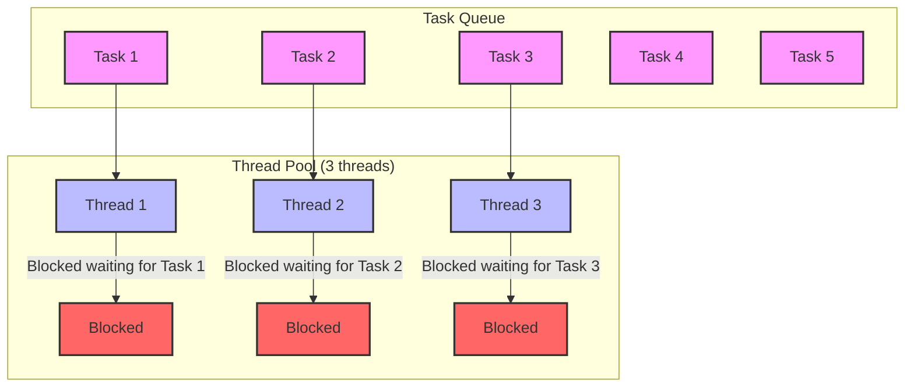

Recently we've seen an abundance of async-only APIs in C# and common libraries like HttpClient.
In most cases, this encourages async/await best practices, especially on the server side, but there are exceptions.
In some situations, we need to call these async methods synchronously.

One common way to do this is `GetAwaiter().GetResult()`

```c
Task<string> pingTask = new HttpClient().GetStringAsync("https://google.com");
var webpage = pingTask.GetAwaiter().GetResult();
```

The `GetAwaiter().GetResult()` call blocks the calling thread and this can cause thread starvation.

Consider an example where you want to fetch a few webpages in parallel.
For simplicity, we will just call `google.com`.
The function looks like this:

```c#
/// <summary>
/// Synchronously pings the URL and returns the result.
/// </summary>
/// <returns>Webpage content</returns>
private static string PingUrlSync()
{
    // Call the asynchronous method and wait for the result
    Task<string> pingTask = new HttpClient().GetStringAsync("https://google.com");
    var webpage = pingTask.GetAwaiter().GetResult();
    return webpage;
}
```

At first glance, this looks fine. If we run this once, we're sure to get the webpage string.
If we want to run this a few times in parallel, we'd do something like this:

```c#
// A randomly high number of iterations
var taskCount = 100;

// Start multiple tasks to ping the URL
for (int i = 0; i < taskCount; i++)
{
    tasks.Add(Task.Run(() => { PingUrlSync(); }));
}
```

This is where the problem starts.
If we add some logging and constrain the .NET thread pool so the number of worker threads matches the number of processors, this code will hang.

```log
processor count: 8
Max worker threads set to 17
Max completion port threads set to 8
PingUrlSync	, Iteration: 0, ThreadId: 4
PingUrlSync	, Iteration: 1, ThreadId: 3
PingUrlSync	, Iteration: 3, ThreadId: 8
PingUrlSync	, Iteration: 2, ThreadId: 7
PingUrlSync	, Iteration: 4, ThreadId: 9
PingUrlSync	, Iteration: 5, ThreadId: 10
PingUrlSync	, Iteration: 6, ThreadId: 11
PingUrlSync	, Iteration: 7, ThreadId: 12
```

In this post, we'll understand why this code hangs and how to investigate such issues in Visual Studio.

## Task Parallel Library
We need a little background on the Task Parallel Library to understand what's going on.

Task Parallel Library (TPL) is a set of public types and APIs in .NET that simplify the process of adding parallelism and concurrency to applications. It was introduced in .NET Framework 4.0 and is the recommended way to write multithreaded and parallel code.

TPL handles the partitioning of work, scheduling of threads on the ThreadPool, cancellation support, state management, and other low-level details. It scales the degree of concurrency dynamically to most efficiently use all available processors.

When running async/await or threaded tasks, all these tasks get pushed to a queue and are scheduled on the thread pool. 

### Async/Await
Essentially, async/await code is internally a set of tasks.

When you call an async method, it returns a task that represents the I/O work.
The return value is a task with a return type.

`Task<string> pingTask = new HttpClient().GetStringAsync("https://google.com");`

When you call `await` on this task, the runtime frees the calling thread and schedules the rest of your code as a continuation.
That continuation runs only after the awaited task is complete.

## Thread Starvation

Now that we have background on the problem and some basics about the Task Parallel Library, we can dig deeper.

When we create the PingUrlSync task, it gets added to the queue and is waiting to be scheduled.
When calling `GetAwaiter().GetResult()`, we are asking the runtime to wait on the current thread for the task to complete.
Essentially, for every `PingUrlSync` call, we now have at least 1 new task and 1 blocked thread.
When we call this method multiple times concurrently, we have multiple blocked threads.

The CLR thread pool is not an unlimited resource. At some point, if you run enough concurrent tasks, you'll end up blocking all the threads, and tasks in the queue will not have any threads available to run on.

At this point, the blocked threads are waiting for tasks to complete, and tasks in the queue are waiting for a thread to free up so they can do their work.
We now have a deadlock, and it results in a hung state.


